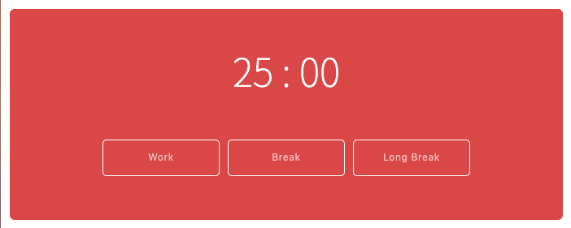

## Pomodoro App
An app that alerts the user every 25 minutes with a beep. User can then choose between a short (5 mins) or longer (15 min) break. The window will alert with a beep once the time expires. 
## Deployment
*...link to site/what to download/what to install
## App in Action

## Build Tools & Languages
- Javascript(ES6)
- Visual Studio Code
- Git
- Github

## What did I learn? 
- Dom Manipulation 
- "new" Keyword and It's uses
- "Date." & How to display dates and times in Vanilla Javascript
- Event listeners 

## Authors 
Michael Sydney Moore            
## License 
N/A